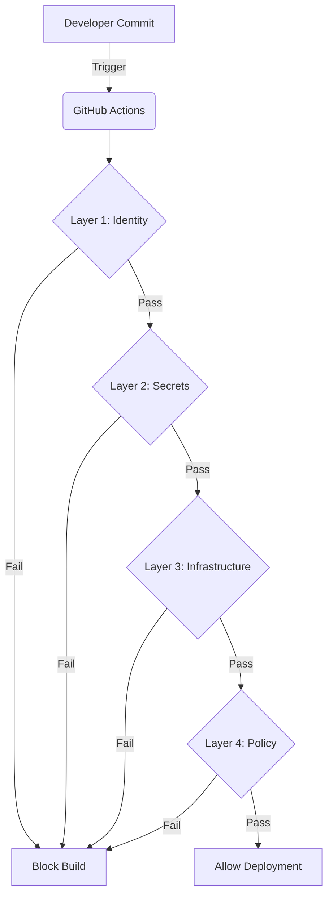

# Policy-Driven Cloud Guardrails Platform 🛡️


## 🚀 Project Overview

An automated **DevSecOps Governance Platform** designed to enforce security, compliance, and operational best practices across cloud infrastructure.

Unlike traditional "security scanners" that only find issues after deployment, this platform operates as a **Shift-Left Control Plane**. It integrates directly into the CI/CD pipeline to block insecure configurations (Infrastructure-as-Code), vulnerable dependencies, and policy violations *before* they can ever reach production.

## 🏗 Architecture

The system follows a **Zero-Trust Pipeline** design pattern:


### The Workflow Layers


1.  **Identity Firewall (Gitleaks):** Scans the codebase for hardcoded AWS keys, API tokens, and private credentials.
2.  **Infrastructure SAST (Checkov):** Performs Static Application Security Testing on Terraform plans to detect misconfigurations (e.g., unencrypted disks, open ports).
3.  **Supply Chain Security (Trivy):** Scans container images and dependencies for known Common Vulnerabilities and Exposures (CVEs).
4.  **Governance Engine (OPA):** Enforces custom business logic using Rego policies (e.g., cost allocation tags, approved instance types).

---

## 🛡 Key Capabilities Implemented

### 1. Identity & Secret Protection
* **Tool:** Gitleaks
* **Function:** Pre-commit secret scanning.
* **Outcome:** Prevents credential leakage by blocking any commit that matches entropy patterns for AWS Access Keys or API secrets.

### 2. Infrastructure Security (SAST)
* **Tool:** Checkov (Bridgecrew)
* **Function:** Static analysis of Terraform templates.
* **Outcome:** Automatically flags security violations such as unencrypted EBS volumes, unrestricted Security Groups (`0.0.0.0/0`), and overly permissive IAM roles.

### 3. Container Vulnerability Management
* **Tool:** Trivy (Aqua Security)
* **Function:** Scans Docker images during the build process.
* **Outcome:** Blocks the deployment of containers containing "High" or "Critical" vulnerabilities, ensuring a secure software supply chain.

### 4. Policy-as-Code (Governance)
* **Tool:** Open Policy Agent (OPA) & Conftest
* **Function:** Enforces arbitrary business logic and compliance rules written in Rego.
* **Example Rule:** *"All EC2 instances must be of type t2.micro or t3.micro to prevent cost overruns and enforce budget compliance."*

---

## 📂 Repository Structure

```text
/infrastructure
  └── /aws                # Terraform definitions (VPC, EC2, Security Groups)
/policies
  ├── allowed_instances.rego  # OPA Policy: Restricts EC2 instance types
  └── custom_checks.yaml      # Checkov Policy: Custom tagging rules
/.github
  └── /workflows
       └── security.yml       # The "Master Guardrail" CI/CD Pipeline
Dockerfile                # Sample container for vulnerability testing
```
## 🔒 Planned Post-Deployment Guardrails (Roadmap)

While the current platform enforces **Pre-Deployment** security, the following architectural enhancements are planned to extend enforcement into the **Post-Deployment** phase.

### 1. Configuration Drift Detection

**The Problem:**  
Manual changes made directly in the AWS Console can bypass CI/CD security checks.

**The Solution:**  
Implement a scheduled GitHub Actions workflow (cron-based) that runs `terraform plan` nightly against the live infrastructure state.

**Outcome:**  
Alerts the security team if production infrastructure drifts from the approved, policy-compliant configuration.

---

### 2. Automated Remediation (Self-Healing Infrastructure)

**The Problem:**  
Waiting for manual intervention to remediate critical misconfigurations (such as open security group ingress rules) increases exposure time.

**The Solution:**  
Deploy AWS EventBridge rules that monitor CloudTrail events (e.g., `AuthorizeSecurityGroupIngress`) and trigger Lambda-based remediation functions.

**Outcome:**  
Automatically reverts non-compliant changes within seconds of detection.

---

### 3. Centralized Security & Compliance Dashboard

**The Problem:**  
Distributed pipeline logs and tool outputs are difficult for stakeholders and management to visualize.

**The Solution:**  
Aggregate JSON outputs from Checkov, Trivy, and OPA into a centralized dashboard (e.g., DefectDojo).

**Outcome:**  
Provides a unified view of vulnerability trends, mean time to remediate (MTTR), and overall cloud security posture.

